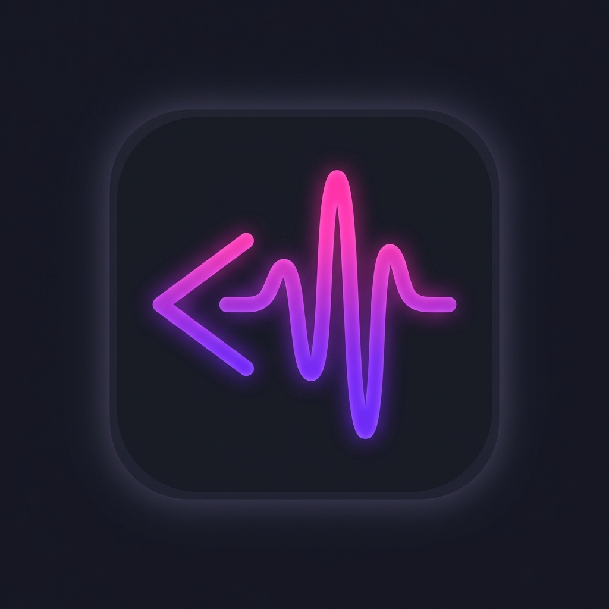

# CodeVibe 🎨

**Adapt your VS Code environment based on your mood** — featuring dynamic themes, ambient sounds, subtle animations, and coding streak tracking.



## ✨ Features

### 🎭 Mood-Based Environment
Select from 5 carefully crafted moods to transform your coding experience:
- **🎯 Focused** — Deep concentration mode with minimal distractions
- **🌿 Relaxed** — Calm and peaceful vibes for stress-free coding
- **⚡ Energized** — High energy productivity boost
- **✨ Creative** — Inspire your imagination with vibrant aesthetics
- **🌙 Not Feeling It** — Gentle mode for low-energy days

### 🎨 Dynamic Themes
Each mood automatically applies a matching VS Code color theme:
| Mood | Default Theme |
|------|---------------|
| Focused | One Dark Pro |
| Relaxed | Dracula Soft |
| Energized | Synthwave '84 |
| Creative | Night Owl |
| Not Feeling It | Nord |

You can customize theme mappings in settings!

### 🔊 Ambient Sounds
Immersive background sounds to enhance focus:
- **Bundled Sounds** — Pre-packaged ambient audio for offline use
- **Streaming Sounds** — Free sounds from online sources (rain, forest, café, ocean, fireplace, wind, thunder, birds)
- **Volume Control** — Adjustable with smooth fade transitions

### 💫 Mood Animations
Subtle, non-distracting visual effects:
- Particles for Creative mood
- Gentle glow for Relaxed mood
- Energy waves for Energized mood
- Soft pulse for low-energy moods

### 🔥 Coding Streaks
Track your coding activity and maintain your streak:
- Daily streak counter
- Longest streak record
- Total coding days
- Visual calendar showing activity history
- Minimum character threshold (configurable)

## 📦 Installation

### From VS Code Marketplace
1. Open VS Code
2. Go to Extensions (Ctrl+Shift+X / Cmd+Shift+X)
3. Search for "CodeVibe"
4. Click Install

### From VSIX File
1. Download the `.vsix` file from releases
2. In VS Code, open the Command Palette (Ctrl+Shift+P / Cmd+Shift+P)
3. Run "Extensions: Install from VSIX..."
4. Select the downloaded file

## 🚀 Usage

1. **Open the Sidebar** — Click the CodeVibe icon (🎨) in the Activity Bar
2. **Select Your Mood** — Click on any mood card to activate it
3. **Adjust Sound** — Use the volume slider or toggle sounds on/off
4. **Track Your Streak** — Your coding activity is tracked automatically!

### Commands
Access via Command Palette (Ctrl+Shift+P / Cmd+Shift+P):
- `CodeVibe: Set Mood` — Quick mood selection
- `CodeVibe: Toggle Sound` — Turn ambient sounds on/off
- `CodeVibe: Show Streak` — View your coding streak stats
- `CodeVibe: Open Settings` — Customize preferences

## ⚙️ Configuration

Customize CodeVibe in VS Code Settings (`Ctrl+,` / `Cmd+,`):

```json
{
  // Mood-specific themes
  "codevibe.moods.focused.theme": "One Dark Pro",
  "codevibe.moods.relaxed.theme": "Dracula Soft",
  "codevibe.moods.energized.theme": "Synthwave '84",
  "codevibe.moods.creative.theme": "Night Owl",
  "codevibe.moods.notFeelingIt.theme": "Nord",
  
  // Sound settings
  "codevibe.sounds.volume": 50,
  "codevibe.sounds.enabled": true,
  "codevibe.sounds.streamingEnabled": true,
  
  // Animation settings
  "codevibe.animations.enabled": true,
  
  // Streak settings
  "codevibe.streak.enabled": true,
  "codevibe.streak.minCharsForActivity": 10
}
```

## 🎵 Sound Sources

CodeVibe uses royalty-free ambient sounds:
- Bundled sounds for offline use
- Streaming from [Freesound](https://freesound.org/) (when enabled)

You can customize sounds by providing file paths in settings.

## 🛠️ Development

```bash
# Clone the repository
git clone https://github.com/codevibe/codevibe-vscode.git
cd codevibe-vscode

# Install dependencies
npm install

# Build
npm run build

# Watch mode
npm run watch

# Package for distribution
npm run package
```

## 📝 Requirements

- VS Code 1.85.0 or higher
- Recommended: Install the theme extensions for full experience

## 🤝 Contributing

Contributions are welcome! Please feel free to submit a Pull Request.

## 📄 License

MIT License - see [LICENSE](LICENSE) for details.

## 🙏 Acknowledgments

- Theme authors for their beautiful open-source themes
- Freesound contributors for ambient sounds
- VS Code team for the excellent extension API

---

**Made with 💜 by developers, for developers**

*Stay in the zone, code with vibes!*
